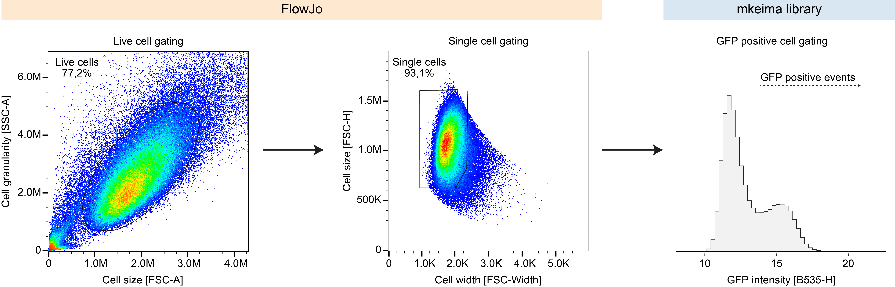

# Publication source repository for mKeima assays in Licheva et al. 2025

**Phase separation of initiation hubs on cargo is a trigger switch for selective autophagy**
<br>
*Mariya Licheva, Jeremy Pflaum, Riccardo Babic, Hector Mancilla, Jana Elsässer, Emily Boyle, David M. Hollenstein, Jorge Jimenez-Niebla, Jonas Pleyer, Mio Heinrich, Franz-Georg Wieland, Joachim Brenneisen, Christopher Eickhorst, Johann Brenner, Shan Jiang, Markus Hartl, Sonja Welsch, Carola Hunte, Jens Timmer, Florian Wilfling and Claudine Kraft*

Published in Nature Cell Biology (January 7, 2025)<br>
DOI: [10.1038/s41556-024-01572-y](https://doi.org/10.1038/s41556-024-01572-y)

This repository provides the complete source code that was used for processing of the cell sorting data from the mKeima assay used in this study and for creating the plots related to the mKeima assay shown in the publication. Please refer to the sections below for detailed instructions on how to reproduce the data analysis from the publication.

The repository inlcudes several folders with the following content: 

- **raw_data**: Contains the cell sorting data exported from FloJo as .csv files. Note that the data was already gated manually for singlets in FlowJo, for an exmple refer to the [gating strategy section](#gating-strategy). (The data is uploaded as .zip files and needs to be extracted before use.)
- **manuscript_analysis_notebooks**: Contains Jupyter notebooks used for the processing of the cell sorting data and to generate the plots shown in the manuscript.
- **processed_data**: Contains the summary result tables created by the analysis of the mKeima assays in the Jupyter notebokes.
- **plots**: Contains the plots created by the analysis of the mKeima assays in the Jupyter notebokes.

## Getting started
To prepare the local repository, follow these steps:
1) Clone the repository from GitHub into a local folder that is accessible by JupyterLab (by default somewhere in your user directory).
   ```shell
   git clone https://github.com/hollenstein/sourcecode_mkeima-assay_licheva-et-al-2024
   ```
1) Navigate to the *raw_data* folder.
1) Extract the contents of the *raw_data_01.zip*, *raw_data_02.zip*, and *raw_data_03.zip* files into the *raw_data* folder.


## Environment setup
To set up the Python environment, follow these instructions:

1) Install Python version 3.11 (we recommend installing Python into a fresh virtual environment).
1) Install the required Python libraries using pip and the provided requirements.txt file.
   ```shell
   pip install -r ./requirements.txt
   ```
1) Install JupyterLab by following the installation instructions from the [JupyterLab website](https://jupyterlab.readthedocs.io/en/stable/getting_started/installation.html).


## Analysis of the mKeima assays with the `mkeima` Python library
1) Launch JupyterLab by executing the `jupyter lab` command in your terminal.
1) Once JupyterLab is running, navigate to the *sourcecode_mkeima-assay_licheva-et-al-2024/manuscript_analysis_notebooks* folder within JupyterLab's file browser.
1) Execute the code from the Jupyter notebooks located in the *manuscript_analysis_notebooks* folder. The order of execution does not matter.
    - Running these notebooks creates the summary result tables and plots shown in the manuscript and saves them into the *processed_data* and *plots* folders.
    - The folders *processed_data* and *plots* already contain those output files, running the Jupyter notebooks locally simply overrides them.


## Gating Strategy

Cell populations were filtered through a series of gating steps to ensure data specificity, as illustrated in the following figure:




### Gating applied with FlowJo

- **Live Cell Gating**: Live cells were identified and gated based on side scatter area (SSC-A) versus forward scatter area (FSC-A) plots.
- **Singlet Gating**: Singlet cells were gated using forward scatter height (FSC-H) versus forward scatter width (FSC-Width) plots.

### Gating applied with the mkeima library

- **GFP-Positive Cell Cutoff**: A threshold for GFP-positive cells was established and applied in the Jupyter notebooks using the `mkeima` library.


## Contributors

- David M. Hollenstein
- Riccardo Babic